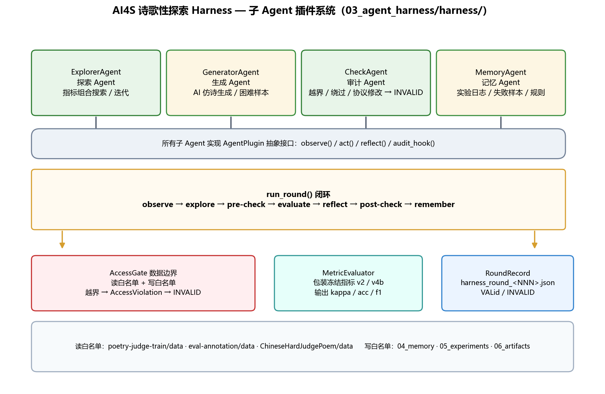
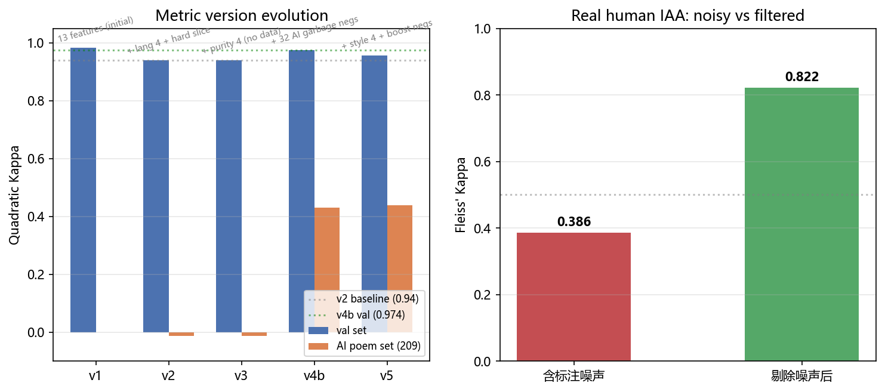
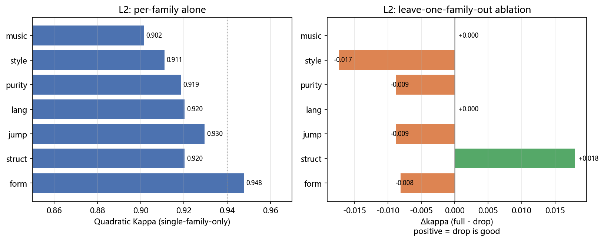
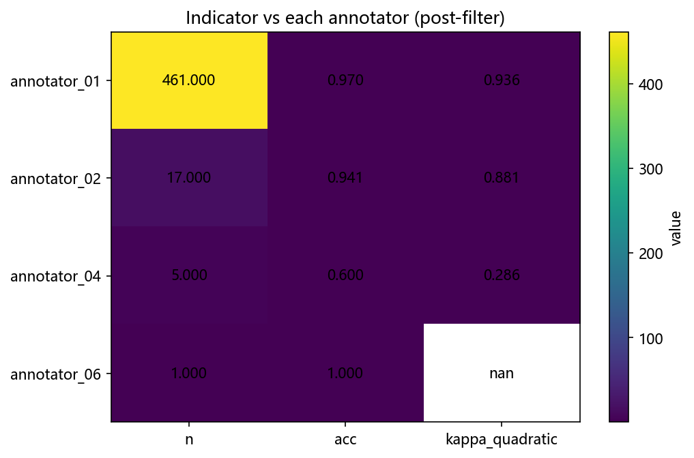
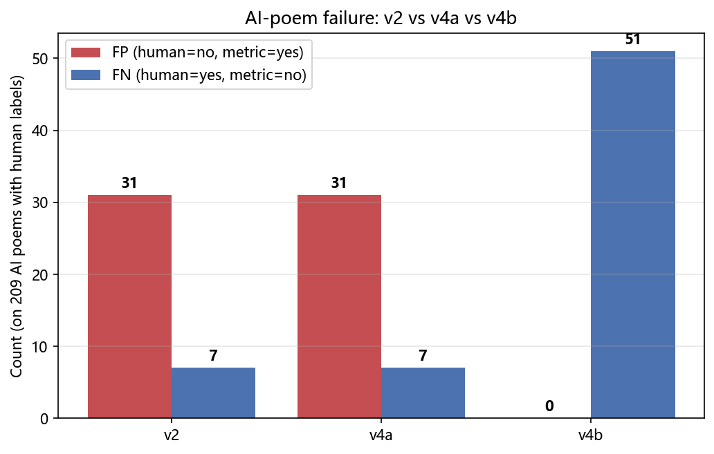
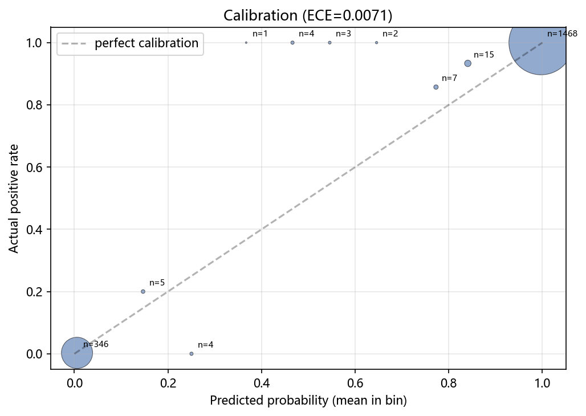
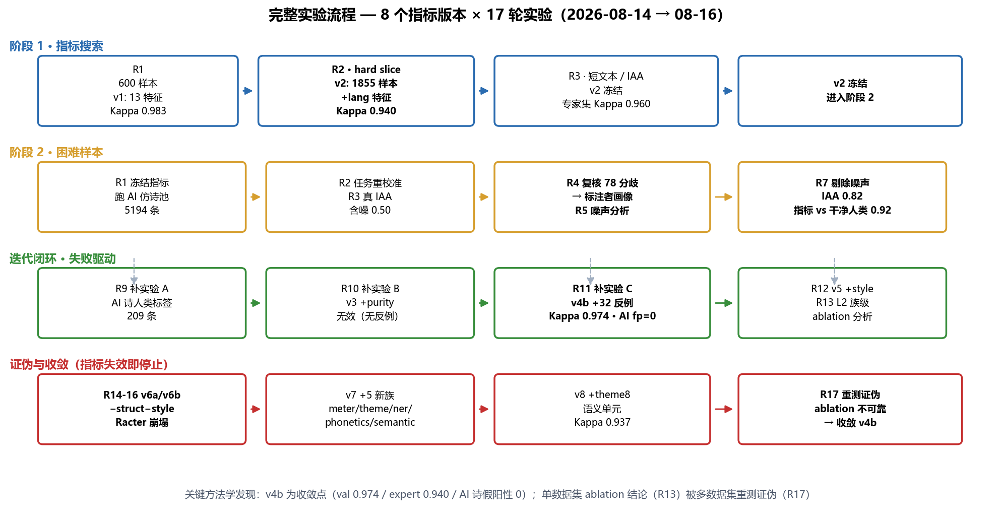

# ChinesePoemBenchmark · 中文诗歌「诗歌性」自动评测指标

> **项目定位**：构建并系统评估一个中文诗歌「诗歌性」自动评测指标（判断一段文本**是否为诗**的二元分类器），
> 并沉淀出配套的 **Benchmark 数据集**、**指标迭代闭环协议** 与 **AI4S 多 Agent Harness**。

[]()
[](LICENSE)
[]()
[](https://github.com/shikunpneg/ChinesePoemBenchmark)
[](https://huggingface.co/shikunpunk)

---

## 目录

1. [为什么构建这个项目](#1-为什么构建这个项目)
2. [如何构建指标与 Benchmark](#2-如何构建指标与-benchmark)
3. [成果展示：生成诗歌 · 指标 · 实验流程](#3-成果展示生成诗歌--指标--实验流程)
4. [如何使用本项目](#4-如何使用本项目)
5. [相关项目与资源](#5-相关项目与资源)

---

## 1. 为什么构建这个项目

### 1.1 背景：AI 写诗在逼近人类，「什么是诗」却没有人能定义

- 大语言模型生成的「AI 诗」质量正在快速逼近人类诗歌。POEMetric (ICLR 2026)、Ma et al. (ACL 2026 Findings) 等研究表明：**顶级 LLM 在形式准确性 / 主题对齐上表现尚可，但在创造力、独特性、情感共鸣、意象、文学手法上仍达不到人类诗人水平**。
- 然而，**对 AI 诗的评测本身依赖「诗性」指标**——一个不可靠的指标会同时误判人类诗和 AI 诗。
- 更根本的困难是：「诗」**没有客观唯一标准**。古典派重视格律平仄，现代派强调自由与意象，普通读者可能以「分行」为标志。任何「诗性」指标都只是**特定人类群体对「诗」的某种定义的代理**。

### 1.2 现有评测手段的缺陷

| 手段 | 问题 |
|---|---|
| BLEU / ROUGE 等词面重叠指标 | 只测词面相似，无法评测主题、情感、意象、形式、风格 |
| LLM-as-a-Judge | 在诗歌任务上**系统性高估**模仿统计模式的机器生成诗，与人类专家判断明显偏离；且存在位置偏差、权威偏差、评分偏差 |
| 单一基础特征（行数、押韵等） | 无法覆盖「语不接而意接」的诗歌逻辑 |

### 1.3 我们要回答的研究问题

> 在中文诗歌中，是否存在可计算的文本特征，能够构成一个与人类在「诗歌 / 非诗歌」二分类上**高度一致**的自动「诗歌性」指标？
> 如果存在，这种一致性在 AI 生成文本逐渐逼近人类诗歌的**困难样本**上，会如何衰减？
> 衰减究竟表现为「**指标先失效**」，还是「**人与指标同步失效**」？

### 1.4 为什么用「指标迭代闭环」而不是一次训练

指标与数据是**共演**的：静态训练一次只能得到一个切片上的拟合，无法暴露「指标在哪些样本上自信地犯错」。
我们提出的工程范式是：

```
部署当前指标 (vN)
  → 在新数据上运行，找「高置信错误」（指标极确定但人类判断相反）
  → 人工复核错误样本，判定「指标错 or 人类错」
  → 指标错：提取失败模式 → 加特征 或 加反例训练样本
  → 人类错：修正标注 → 重新评估
  → 重训 (vN+1) → 在 OLD + NEW 数据上评估 → 对比 vN vs vN+1 → 通过则发布
```

这一闭环驱动了 v1 → v8 共 8 个指标版本、17 轮实验的完整演进，并最终在 **v4b** 收敛。

---

## 2. 如何构建指标与 Benchmark

### 2.1 指标定义

给定一段中文文本 x，输出二元判断 ŷ ∈ {0,1}（1 = 是诗）。评估指标是 **ŷ 与人类判断的一致性**，采用 **Quadratic Weighted Kappa**（强调对严重不一致的惩罚）。

### 2.2 特征库：12 族 63 维（58 自有 + 5 平凡解 baseline）

| 族 | 特征数 | 计算原理 | 设计意图 |
|---|---|---|---|
| **meter** | 7 | 近体诗格律（句式 A/B/C/D、粘对、押韵、对仗、诗体判定） | 古典格律标准 |
| **struct** | 3 | 行数 / 行尾标点 / 短行比例 | 视觉结构 |
| **para_theme** | 9 | 段落统计 + jieba 关键词主题分析 | 段落底层逻辑 |
| **theme8** | 6 | 语义单元（合并短行）上的主题分析 | 修短行稀疏性 |
| **ner_img** | 9 | NER 抽取意象 + 意象场顺序逻辑（bge 语义相似度） | 诗歌逻辑 |
| **semantic** | 6 | bge-small-zh 嵌入（相邻行相似 / 断裂-引力 / 整体性） | 语义向量 |
| **lang** | 4 | 意象密度 / 文言虚词 / 散文助词 / 有无分行 | 词汇诗性 |
| **purity** | 4 | 汉字占比 / 无英文 / 无数字 / 行纯净 | 文本纯净度 |
| **style** | 4 | 新闻词 / 短语 / 论坛语气 / 段长 | 语域信号 |
| **jump** | 3 | 连接词密度 / 每行字数 / 行长变异 | 逻辑跳跃（历史保留） |
| **music** | 3 | 平仄规律 / 均衡 / 末字平声（简化版） | 音乐性（历史保留） |
| **phonetics** | 6 | 五度调值曲线 / 元音开口度 / 韵母音位距离 | **真实声学信号** |
| **baseline** | 5 | bleu / bigram / tfidf 到诗与非诗语料 | 字符重叠参照 |

其中 5 个核心新族：

- **meter（近体诗格律）**：pypinyin 判定平仄（1/2 调→平，3/4 调→仄），匹配五言/七言 A/B/C/D 标准句式；粘对（相邻行平仄相反/相同）；偶数行末字押韵一致比例；律诗对仗用词性序列重合率近似。
- **phonetics（真实声学信号）**：音乐性根植于**实际发音**而非文字表面——声调映射五度调值（1调→5 … 4调→1）计算平滑度；韵母主元音开口度（共振代理）；韵母音位距离（验证：光(guang)/霜(shuang)=0.0 同韵 ✅，光/河(he)=1.0 ✅）。
- **ner_img（意象场顺序逻辑）**：jieba.posseg 识别名词/动词，命中 7 类意象场词表（天象/山水/动物/季节/情感/感官/现代）；相邻实体用 **bge 语义相似度**替代字符重叠——「明月↔霜」字符重叠 0.0，bge 余弦 **0.406**，正确捕捉「断裂-引力」（语不接而意接）。
- **semantic（bge-small-zh 语义向量）**：BAAI/bge-small-zh-v1.5（24M 参数 / 512 维，CPU 可跑）；相邻行余弦均值/变异系数、首尾行余弦、断裂-引力复合。6870 条文本 10.6 万行编码缓存 5.25 分钟，命中后 0.004s/批。
- **para_theme / theme8（段落主题 NLP）**：先把短行古诗合并为「语义单元」（≥12 字），再提取内容词 TF 向量，计算主题跳跃度 / 变异系数 / 聚焦度 / 回环 / 首尾呼应。

### 2.3 分类器与评估协议

- **分类器**：Logistic 回归（C=1.0, class_weight=balanced, max_iter=3000, seed=42），特征 StandardScaler 标准化。
- **固定验证集**：`train_val_split(seed=42, val_ratio=0.2)`，确保跨版本可比。
- **跨数据集评估**（防止单集过拟合，R17 教训）：
  - 原验证集 split（371 条）
  - 专家集 samples.js（100 条：50 顾城/海子/张枣 + 50 Racter 翻译）
  - AI 仿诗集（209 条：hard_gen 匹配 + annotator_06 人类标签）

### 2.4 Benchmark 数据集

| 数据集 | 数量 | 来源 | 用途 |
|---|---|---|---|
| poetry-judge-train（v2 corpus） | 1855 | 人类标注 | 训练 + 验证（1500 诗 + 355 非诗） |
| 专家集 samples.js | 100 | 人工精选 | 50 现代诗 + 50 Racter 散文诗 |
| 评估标注（4 CSV 合并去重） | 1613 | 生产标注平台 | 人类 IAA / 指标对比 |
| AI 仿诗 hard_gen_*.jsonl | 5194 | LLM 生成（李白/顾城/海子） | 指标失效边界 |
| **AI 诗 + 人类标签** | **209** | 上述交叉 | **首次有真人类标签的 AI 诗评测集** |

> 所有数据为**只读引用**（见 `02_environment/data_registry/README.md`），项目产物统一落在 `04_memory/`、`05_experiments/`、`06_artifacts/`。

### 2.5 AI4S Harness：子 Agent 插件系统

整个「构建指标 + 构建 Benchmark」的过程运行在一个多 Agent Harness 上（`03_agent_harness/harness/`），
对应方案《第一版.pdf》§2 环境接口 / §3 发现信号 / §4.1 试跑闭环：



| 子 Agent | 类 | 职责 |
|---|---|---|
| 探索 Agent | `ExplorerAgent` | 指标组合搜索：提出特征组合 → 评估与人类一致性 → 迭代 |
| 生成 Agent | `GeneratorAgent` | AI 仿诗生成：动态提高相似度 → 收集困难样本 |
| 审计 Agent | `CheckAgent` | 边界审计：数据越界 / 规则绕过 / 协议修改 → 标 INVALID |
| 记忆 Agent | `MemoryAgent` | 记忆与沉淀：实验日志 / 失败样本 / 违规规则 |

- **AccessGate**：读写白名单强制（读：poetry-judge-train / eval-annotation / ChineseHardJudgePoem；写：04_memory / 05_experiments / 06_artifacts），越界抛 `AccessViolation`。
- **MetricEvaluator**：把已冻结指标（v2 / v4b）包装为 evaluator，输出每轮 kappa / acc / f1 + VALID/INVALID。
- **RoundRecord**：每轮 `harness_round_<NNN>.json` 前缀日志，避免与手工实验冲突。
- 运行闭环：`observe → explore → pre-check → evaluate → reflect → post-check → remember`。

---

## 3. 成果展示：生成诗歌 · 指标 · 实验流程

### 3.1 生成诗歌展示（AI 仿诗 vs 人类原诗）

Benchmark 的「AI 仿诗池」（`ChineseHardJudgePoem`）由 LLM 以「你是诗人 X」提示词生成，模仿李白/顾城/海子等诗人。以下为生成示例（`generated`）与对应的人类原诗（`real_text`）：

**示例 1：海子风格《草原上》**

```text
—— AI 生成 ——                         —— 人类原诗（海子）——
我从远方赶来                         在赤裸的高高的草原上
来到这神秘的草原                     我相信这一切：
                                     我的脚，一颗牝马的心
草原上只有天空和日头                   两道犁沟，大麦和露水
草原上只有神和神的儿子
                                     在那高高的草原上，白云浮动
在草棵上端坐了千年                     我相信天才，耐心和长寿
成为永恒的山羊                         我相信有人正慢慢地艰难地爱上我
在草原上端坐                           别的人不会，除非是你
神的山羊                               我俩一见钟情
神的儿子
                                     在那高高的草原上
今天我第一次来到这里                   赤裸的草原上
神的儿子 今天的雨水                    我相信这一切
落在我的头上 像远古的云朵               我相信我俩一见钟情
```

**示例 2：顾城风格《也许，我不该写信》**

```text
—— AI 生成 ——                         —— 人类原诗（顾城）——
也许，我不该写信                     也许，我不该写信
不应该                               我不该用眼睛说话
去赞美蜂蝶                           我被粗大的生活
那娇艳绚丽的花                       束缚在岩石上
虽然它们使世界                       忍受着梦寐的干渴
五彩缤纷                             忍受着拍卖商估价的
使早晨的空气                         声音，在身上爬动
洋溢着甜蜜的诱惑
                                     我将被世界决定
……                                  我将被世界决定
                                     却从不曾决定世界
我不该写信
不应该                               我不该写信
去赞美蜂蝶                           不应该，请你不要读它
虽然我也会                           把它保存在火焰里
不时从梦里醒来                       直到长夜来临
把火热的泪水
涂在素色的纸上
写下：也许，我不该
去赞美蜂蝶
```

> 观察：AI 能模仿**意象与句式表层**（草原、神的儿子、反复咏叹），但缺少人类原诗中的**张力与转折**（顾城诗中「我将被世界决定，却从不曾决定世界」的悖论）。
> 这正是「结构性指标能捕捉形式、难以捕捉诗意」的直观体现。

### 3.2 指标展示

**最终冻结指标 v4b 关键数字：**

| 维度 | 数值 |
|---|---|
| 验证集 Quadratic Kappa（v4b） | **0.974** |
| 专家集 Kappa（v4b） | **0.940** |
| AI 仿诗集假阳性（v4b） | **0**（v2 为 31） |
| 剔除标注噪声后：指标 vs 干净人类多数票 | **0.924** |
| 剔除标注噪声后：真实人类 IAA | **0.822**（含噪仅 0.50） |

**版本演进（8 个版本 × 17 轮）：**



| 版本 | 改动 | val Kappa | AI 诗 Kappa | expert Kappa | 备注 |
|---|---|---|---|---|---|
| v1 | 13 特征 + LR（600 样本） | 0.983 | — | — | 基线（简单切片） |
| v2 | +lang 特征 + 难切片 | 0.940 | -0.012 | 0.940 | 冻结 |
| v3 | +purity 特征（无反例） | 0.940 | -0.012 | — | **无效**（闭环教训） |
| **v4b** | **+32 AI 垃圾负样本** | **0.974** | **0.431** | **0.940** | **迭代闭环·最优** |
| v5 | +style 特征 | 0.957 | 0.438 | — | social/news 已 100% reject |
| v6a/v6b | −struct −style | 0.921/0.937 | — | **0.920/0.840** | **Racter 崩塌，证伪** |
| v7b | +meter/theme/ner/semantic/phonetics | 0.947 | 0.438 | 0.900 | 可解释性提升 |
| v8b | +theme8 语义单元 + bge 实体 | 0.937 | — | 0.840 | 未超 v7b |

**「指标失效」案例（阶段 2 的核心发现）：**

v2 在 209 条 AI 仿诗上假阳性 31 条——**全部是夹带英文 / 乱码的 AI 诗**：

> 例 1：「玫瑰汗漫无人识，紫禁仙舆特敕开。… `Initialization: function() { return '草' }` …」
> 例 2：「`S` 河流苍浪急，岸叠翠璧孤。… `ylon` 烟水明绝殊。」
> 例 3：「… `quadrupes` 五岭坚。… `Fall into the clear rill`…」

**人类一眼看出「混入英文不像诗」，但 v2 指标只看汉字结构被骗了**——这是结构性指标的**根本边界**。
v4b 通过把 32 条「人类标非诗」的 AI 仿诗加入反例训练集，让 Logistic 回归学到「han_ratio（汉字占比）低 → 更可能是非诗」，假阳性归零。

**子指标族级分析（L2）与 IAA：**

  

- `form`（行数 / 古典格式）是最重要的单族（单独 Kappa 0.948）；`struct`/`style` 单独评估弱，但**删掉会引发灾难性回归**（Racter 崩塌）。
- 每个标注者都有 ~30% 的高置信错误（关键词匹配偏差 + 古典诗盲区）；**剔除噪声后，指标 ≈ 干净人类**。

  

### 3.3 完整实验流程



- **阶段 1（R1-R3，指标搜索）**：600 简单样本 → 1855 hard-slice（v2，Kappa 0.940）→ 短文本 / IAA / 专家集（0.960）→ **v2 冻结**。
- **阶段 2（R1-R7，困难样本）**：冻结指标跑 5194 条 AI 仿诗池 → 任务重校准 → 连入生产标注库（109,369 样本 / 4 用户）获得**真实 IAA** → 人工复核 78 个分歧（颠覆性发现：标注者画像）→ 剔除噪声后 IAA 0.822。
- **迭代闭环（R9-R13）**：AI 诗人类标签（209 条）→ v3 加 purity 无效（无反例）→ **v4b 加 32 反例（Kappa 0.974，AI 假阳性 0）** → v5 +style → L2 族级 ablation。
- **证伪与收敛（R14-R17）**：v6a/v6b 删除 struct/style 后 Racter 崩塌（expert 0.920/0.840）→ v7 五大新族 → v8 语义单元 → **R17 多数据集重测证伪了单集 ablation 结论** → 停止迭代，**v4b 冻结**。

> **方法学警示（R17）**：单数据集 L2 ablation 曾建议「删除 struct/style 更好」（val +0.018/+0.017），
> 但 v6a/v6b 在全评估上均不如 v4b——**ablation 结论只在 val 单集成立，未推广到多数据集**。
> 特征选择必须跨切片验证，否则会引入灾难性回归。这本身就是本研究的发现之一。

---

## 4. 如何使用本项目

### 4.1 仓库结构

```
ChinesePoemBenchmark/
├── README.md                       # 本文件
├── LICENSE                         # MIT License
├── requirements.txt                # Python 依赖
├── paper_draft.md                  # 论文初稿 v1.3（含 v6 证伪 + v7/v8 完整结果）
├── metric_iteration_plan.md        # 指标组合迭代方案
├── 00_docs/                        # 项目总览（方案摘要 / 进度日志 / 迭代计划）
├── 01_problem_definition/          # 问题定义（研究价值 / 为什么非结构化）
├── 02_environment/                 # 指标实现 + 数据加载
│   └── baseline_metrics/
│       ├── code/                   # 特征 / 模型 / 评估（features / meter / phonetics / semantic …）
│       └── feature_catalog.md      # 特征目录
├── 03_agent_harness/               # AI4S Harness（4 子 Agent + AccessGate + 评估器）
│   ├── harness/                    # 可运行的 harness 代码
│   ├── plans/                      # 阶段 1 / 2 计划
│   ├── skills/                     # 可调用技能
│   ├── prompts/                    # 系统提示词
│   └── check_agent/                # 审计规则
├── 04_memory/                      # 实验日志 + 失败样本
│   ├── experiment_logs/            # round_001~003 / stage2_round_001~017 / harness_round_*
│   └── failures/                   # 失败模式与歧义分析
├── 05_experiments/                 # 实验运行产物（stage1_metric_search / stage2_hard_samples）
├── 06_artifacts/                   # 报告 + 图表（reports/figures / reports/tables）
├── 07_reproducibility/             # 复现配置
├── 08_external_refs/               # 外部引用清单
└── docs/                           # 图表生成脚本与 README 图
```

### 4.2 环境安装

```bash
git clone https://github.com/shikunpneg/ChinesePoemBenchmark
cd ChinesePoemBenchmark
pip install -r requirements.txt
```

可选（语义向量特征需要，CPU 即可）：

```bash
pip install sentence-transformers
# 首次运行会自动下载 BAAI/bge-small-zh-v1.5
```

### 4.3 复现冻结指标 v4b

```python
from pathlib import Path
import sys
sys.path.insert(0, str(Path("02_environment/baseline_metrics").resolve()))

from code.frozen_metric import build_and_freeze

# 训练并冻结 v4b（1855 条 + 32 条 AI 反例）
model = build_and_freeze()   # -> val Kappa 0.974 / expert 0.940 / AI 诗假阳性 0
```

### 4.4 评估与新数据推理

```python
from code.frozen_metric import load_frozen, predict

metric = load_frozen("05_experiments/stage2_hard_samples/round_001/frozen_metric.pkl")
prob = predict(metric, "黑夜给了我黑色的眼睛，我却用它寻找光明")
```

### 4.5 运行 AI4S Harness

```bash
cd 03_agent_harness/harness
python run_harness.py --rounds 2 --model v2     # 真实 v2 评估闭环
python harness.py                               # 4 子 Agent + 闭环 + 越界检测自测
```

输出：每轮 kappa/acc/f1 + VALID/INVALID + `05_experiments/dry_run/harness_run.json`。

### 4.6 数据依赖

本仓库**不包含原始数据**，通过 `02_environment/data_registry/README.md` 只读引用以下数据集（均为本地路径）：

| 名称 | 路径 | 用途 |
|---|---|---|
| 中文诗歌集 | `E:\生成诗歌\诗歌集\` | 诗歌原文（古典 / 现当代） |
| 人类标注 | `E:\生成诗歌\poetry-judge-train\` | 诗歌/非诗歌二分类标签 |
| 细粒度标注 | `E:\生成诗歌\eval-annotation\` | 评价协议标注 |
| AI 诗歌池 | `E:\生成诗歌\dataset-build\` | 第二阶段起始池 |
| 困难样本 | `E:\生成诗歌\ChineseHardJudgePoem\` | AI 仿诗（李白/顾城/海子） |

---

## 5. 相关项目与资源

### 5.1 人类标注平台

- **[newthors.cn](https://newthors.cn)**：本项目使用的人工标注平台。生产环境 PostgreSQL 含 **109,369 条样本 / 4 位标注者 / 2,400 条待分配任务**。
  阶段 2 的「真实人类 IAA」评估（含噪 0.50 / 剔噪 0.82）与「指标 vs 干净人类 0.924」均基于该平台产出的 1,613 条标注。

### 5.2 HuggingFace 模型

本项目全部模型托管于 **[huggingface.co/shikunpunk](https://huggingface.co/shikunpunk)** 组织：

**诗歌判断模型（LLM 判断基线，与结构指标互补）**

| 模型 | 说明 |
|---|---|
| [poetry-judge-qwen2.5-1.5b-cn](https://huggingface.co/shikunpunk/poetry-judge-qwen2.5-1.5b-cn) | 基于 Qwen2.5-1.5B-Instruct 的 QLoRA 4bit 微调，Rationale Distillation 策略（2400 条判断理由 SFT）；200 条评测集准确率 **90.00%**（基线 53.50%） |
| [poetry-judge-qwen2.5-1.5b-cn-neutral](https://huggingface.co/shikunpunk/poetry-judge-qwen2.5-1.5b-cn-neutral) | 中性 prompt 改进版 |

**诗歌生成模型（Benchmark AI 仿诗池的风格来源）**

| 模型 | 说明 |
|---|---|
| [Qwen2.5-3B-LiBai](https://huggingface.co/shikunpunk/Qwen2.5-3B-LiBai) | 李白风格：王琦注本《李太白全集》878 首亲笔诗 QLoRA SFT（严格正文边界截断 + 评注剥离） |
| [Qwen2.5-3B-GuCheng](https://huggingface.co/shikunpunk/Qwen2.5-3B-GuCheng) / [Qwen2.5-3B-Haizi](https://huggingface.co/shikunpunk/Qwen2.5-3B-Haizi) / [Qwen2.5-3B-Haizi-CN](https://huggingface.co/shikunpunk/Qwen2.5-3B-Haizi-CN) | 顾城 / 海子（中英）风格 |
| [Qwen3.8-27B-GuCheng](https://huggingface.co/shikunpunk/Qwen3.8-27B-GuCheng) / [Qwen3.8-27B-Haizi](https://huggingface.co/shikunpunk/Qwen3.8-27B-Haizi) | 27B 更大规模版本 |
| [Qwen1.5-7B-Poem-SFT](https://huggingface.co/shikunpunk/Qwen1.5-7B-Poem-SFT) | 通用诗歌 SFT |

**语义向量模型（特征族依赖，第三方）**

- **[BAAI/bge-small-zh-v1.5](https://huggingface.co/BAAI/bge-small-zh-v1.5)**：semantic / ner_img 特征族使用的嵌入模型。
  24M 参数 / 512 维 / 中文，CPU 可跑。用于「断裂-引力」语义相似度（如「明月↔霜」余弦 0.406）与语义单元主题分析。

### 5.3 数据集

**HuggingFace Datasets（[shikunpunk 组织](https://huggingface.co/shikunpunk)）**

| 数据集 | 说明 |
|---|---|
| [poetry-judge-dataset](https://huggingface.co/datasets/shikunpunk/poetry-judge-dataset) | 诗歌判断 SFT 数据（含判断理由，用于训练 judge 模型） |
| [poetry-judge-dataset-neutral](https://huggingface.co/datasets/shikunpunk/poetry-judge-dataset-neutral) | 中性 prompt 版本 |
| [haizi-poetry-dataset](https://huggingface.co/datasets/shikunpunk/haizi-poetry-dataset) | 海子诗歌数据集（用于 Qwen2.5-3B-Haizi 微调） |
| [libai-poetry-dataset](https://huggingface.co/datasets/shikunpunk/libai-poetry-dataset) | 李白诗歌数据集（用于 Qwen2.5-3B-LiBai 微调） |

**本仓库数据**

- Benchmark 数据目录结构见 [4.1 仓库结构](#41-仓库结构) 与 [4.6 数据依赖](#46-数据依赖)。
- 原始数据（诗歌集 / 标注 / AI 仿诗池）通过 `02_environment/data_registry/README.md` 只读引用。

### 5.4 关联仓库

- **[shikunpunk-deepseek-harness](https://github.com/shikunpneg/shikunpunk-deepseek-harness)**：本项目 Harness 的 DeepSeek Harness 集成仓库，采用三层结构：
  1. `research/poetry-poetricity-harness/` —— 独立可运行的 Python Harness；
  2. `.agents/skills/dsh-poetry-poetricity/` —— 仓库级 Skill；
  3. `dsh-plugin/` —— TypeScript 插件 Provider（可安装进 DSH Web）。

### 5.5 引用论文

| 编号 | 引用 | 来源 |
|---|---|---|
| [1] | Li B, et al. *POEMetric: The Last Stanza of Humanity.* | ICLR 2026 |
| [2] | Ma B, et al. *Capabilities and Evaluation Biases of LLMs in Classical Chinese Poetry Generation.* | ACL 2026 Findings |
| [3] | Chen Y, et al. *Evaluating Diversity in Automatic Poetry Generation.* | EMNLP 2024 |
| [4] | Li W, et al. *From Scaffolding to Assimilation.* | ACL 2026 Findings |
| [5] | Sawicki P, et al. *Can LLMs Surpass Non-Experts in Poetry Evaluation?* | arXiv 2025 |

---

## License

[MIT](LICENSE)

## 引用本项目

```bibtex
@misc{chinesepoembenchmark,
  author = {AI4S Poetry Poetricity Team},
  title = {ChinesePoemBenchmark: 中文诗歌「诗歌性」自动评测指标与基准},
  year = {2026},
  url = {https://github.com/shikunpneg/ChinesePoemBenchmark}
}
```
